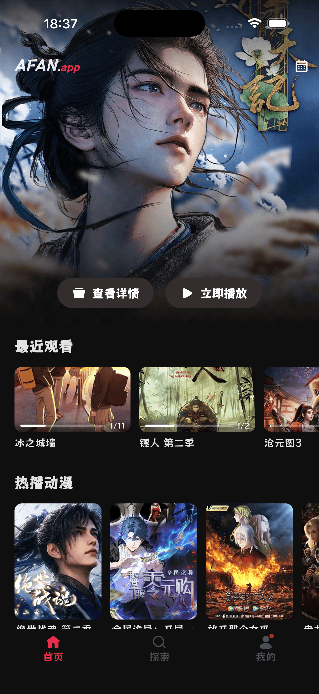
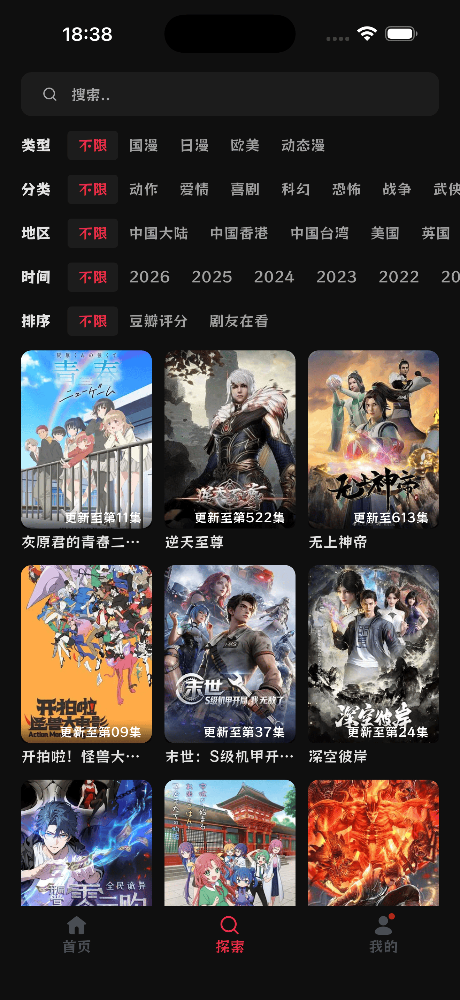
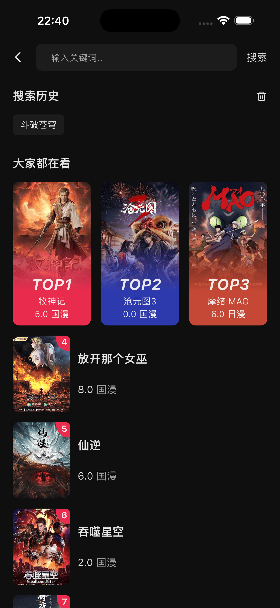
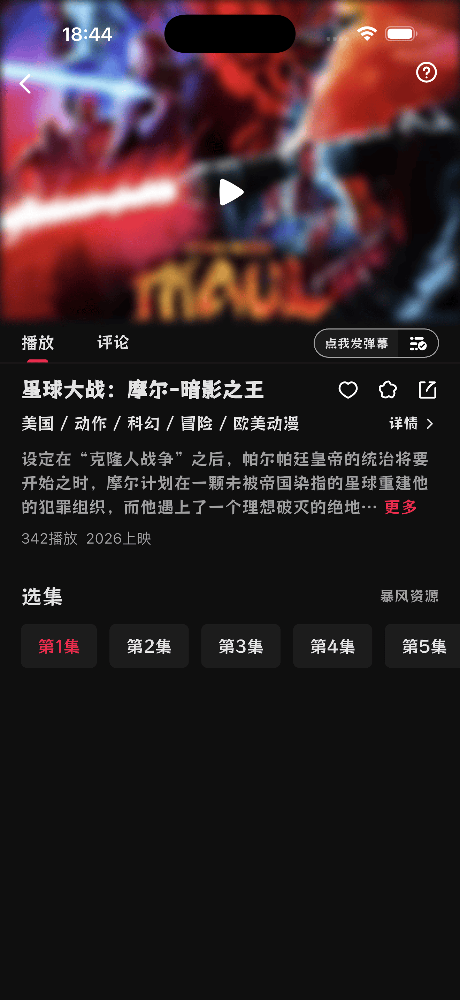
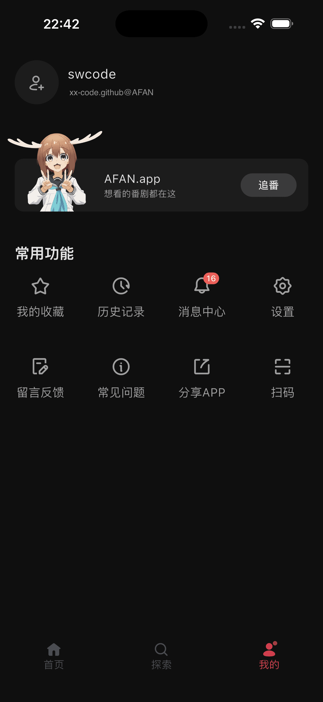
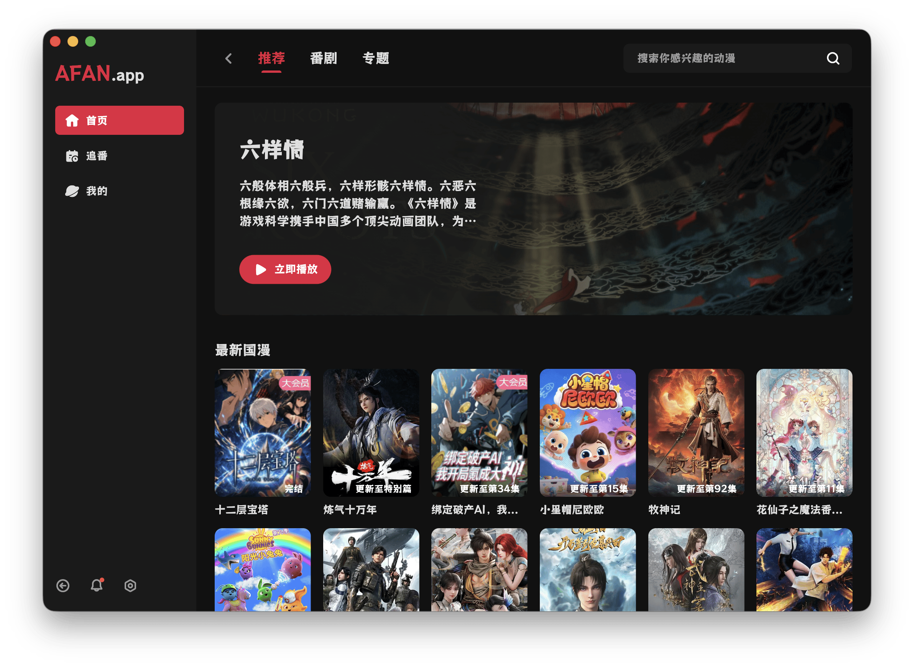
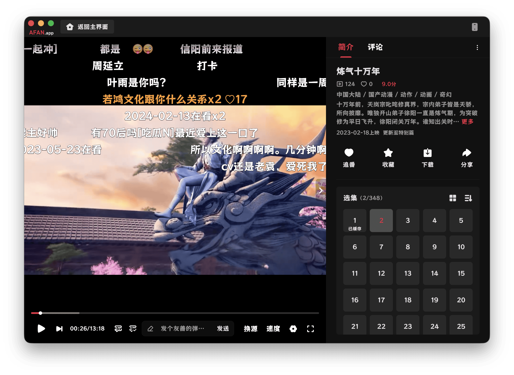
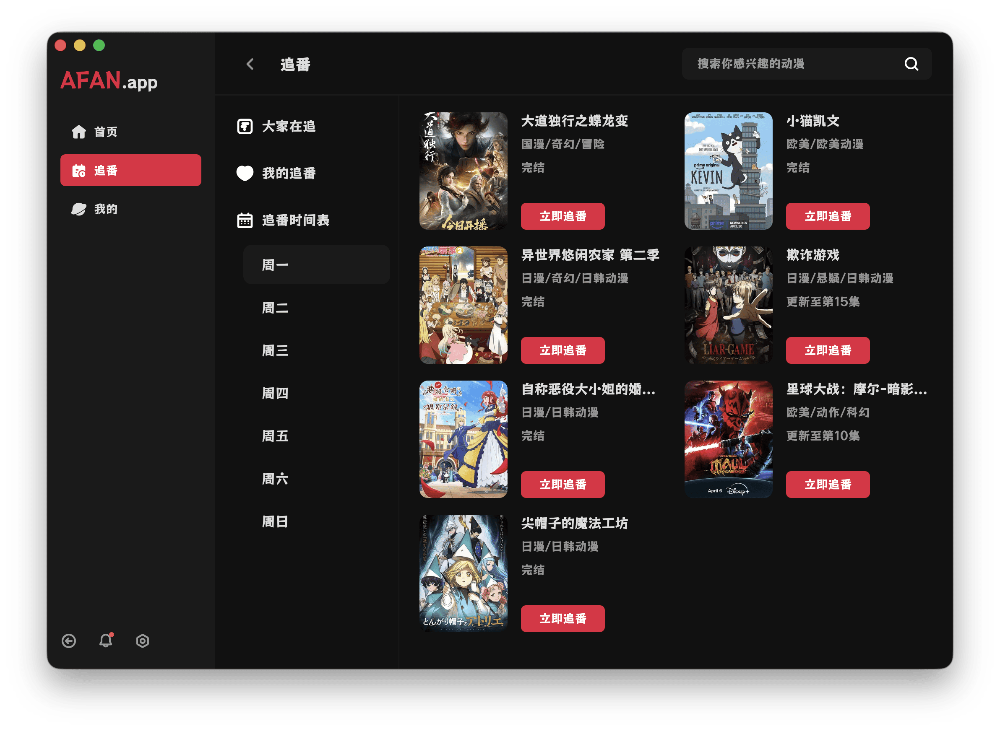
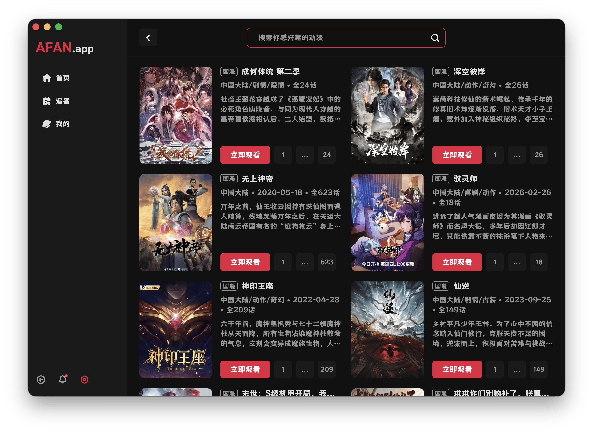
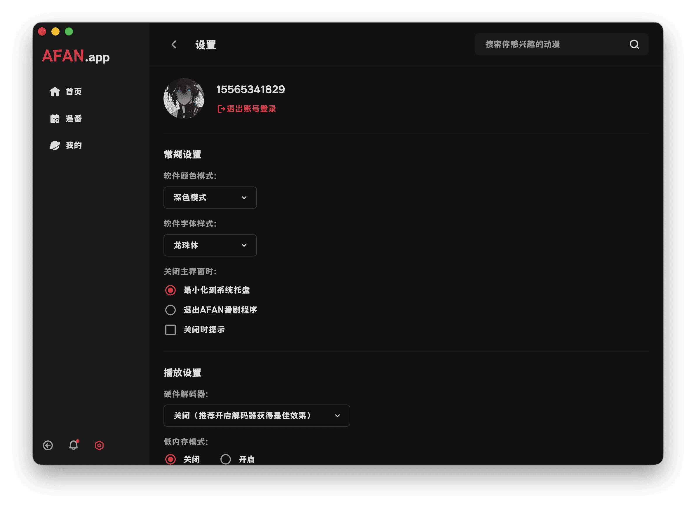

<p align="center"></p>
<h1 align="center">AFAN</h1>

<p align="center">一款使用 Flutter 开发，集成切片、网页嗅探等多种自定义播放源的追番应用。支持番剧搜索查找、追番提醒、视频超分等实用功能，界面简洁清爽，为番剧爱好者提供便捷的追番观影体验。</p>

## 支持平台

- Android
- iOS（自签名）
- HarmonyOS（侧载安装）
- MacOS
- Windows
- Linux
- TV

## 屏幕截图

### 手机端UI鉴赏

<table border="1" cellpadding="8" cellspacing="0" width="100%">
  <tr>
    <td></td>
    <td></td>
    <td></td>
  </tr>
  <tr>
    <td></td>
    <td></td>
    <td></td>
  </tr>
</table>


### 电脑端UI鉴赏








## 功能/开发计划

- [✓] 番剧筛选
- [✓] 番剧搜索
- [✓] 番剧播放
- [✓] 播放设置
- [✓] 播放进度
- [✓] 超分辨率
- [✓] 视觉辅助
- [✓] 弹幕系统
- [✓] 评论系统
- [✓] 番剧收藏
- [✓] 浏览历史
- [✓] 消息通知
- [✓] 番剧专题
- [✓] 投屏功能
- [✓] 缓存功能
- [✓] 切片播放源
- [✓] 嗅探播放源
- [✗] 敬请期待

## 下载
-  [Gitee | Releases](https://gitee.com/SX-Code/afan/releases)
-  [Github | Releases](https://github.com/SX-Code/afan/releases)

## 播放源

### 切片源
软件可自定义切片源，播放源为通用的资源采集站采集接口，要求其返回数据类型为JSON，格式如下：
```json
{
  "code": 1,
  "msg": "数据列表",
  "page": 1,
  "pagecount": 5,
  "limit": 20,
  "total": 96,
  "list": [
    {
      "vod_id": 132241,
      "vod_name": "采集资源",
      "type_id": 40,
      "type_name": "国产动漫",
      "vod_en": "caijiziyuan",
      "vod_time": "2026-02-11 23:42:16",
      "vod_remarks": "完结",
      "vod_play_from": "bfzym3u8"
    }
  ],
  "class": [
    {
      "type_id": 40,
      "type_pid": 39,
      "type_name": "国产动漫"
    }
  ]
}
```

为快速准确的检索番剧，需对资源类型进行映射，规则如下：

> 以下在界面上只需要下拉选择正确映射关系即可，没有映射关系可选择下拉第一项：无匹配类型

1、AFAN资源映射：
```json
{"1": "国漫", "2": "日韩", "3": "欧美", "4": "港台", "5": "海外"}
```
2、切片源资源映射：
```json
{"29": "国产动漫", "30": "日本动漫", "31": "欧美动漫", "32": "香港动漫", "33": "海外动漫"}
```
3、则映射关系配置为：
```json
{"29": 1, "30": 2, "31": 3, "32": 4, "33": 5}
```


注意：

1、采集源无需携带任何参数，类似`?ac=list&t=xx`，保留干净的链接即可
```bash
https://xxx.collect.cpm/api.php/provide/vod/
```
2、采集源需要支持搜索功能，可以在采集接口追加`?ac=list&wd=王`进行测试：
```bash
https://xxx.collect.cpm/api.php/provide/vod/?ac=list&wd=王
```

### 嗅探源

软件可自定义嗅探源，通过执行 JavaScript 脚本从网页中获取资源播放链接：

> 完整模版：[Sniff Template](./document/sniff-template.js)，可在软件采集源仓库中获取嗅探源脚本参考编写。

```javascript
/**
 * 填充验证码
 * @param {string} code 验证码
 */
async function fillCaptureCode(code) { }

/**
 * 嗅探资源
 */
async function sniffResource() { }

/**
 * 嗅探分集
 */
async function sniffEpisode() { }

/**
 * 嗅探播放链接
 */
async function sniffPlayUrl() { }

```


## 声明

1、本项目仅为技术学习与交流使用，所有影视资源均收集自互联网公开渠道，非商用、非盈利。

2、项目开发者不对任何资源的版权、真实性、完整性、安全性负责，资源版权均归原作者或权利人所有。

3、若您认为本项目中某些内容侵犯了您的合法权益，请通过 Issues 或邮箱联系，我将在核实后立即删除相关内容。

4、使用者在下载、观看、传播相关内容时，请自行遵守当地法律法规，由此产生的任何法律责任由使用者自行承担，与本项目及开发者无关。

5、本项目仅提供资源阅览，不提供存储、上传、分发服务。

6、用户使用自定义播放源产生的影响及后果，与项目及开发者无关。

## 隐私政策

本应用在未登录状态下不会收集任何用户信息。登录后仅为实现身份验证收集设备 ID，并记录您的播放进度等个人使用数据，所有信息仅用于提供对应账号服务，不会向第三方共享或用于其他用途。

## 致谢

- 感谢 [LongZhuTi](https://github.com/maoken-fonts/LongZhuTi) 为本项目提供默认字体。
- 感谢 [Dart](https://dart.dev/) 与 [Flutter](https://flutter.dev/) 为本项目提供坚实的技术基石。
- 感谢 [Dio](https://github.com/cfug/dio/blob/main/dio) 提供高效可靠的网络请求支持。
- 感谢 [media-kit](https://github.com/media-kit/media-kit) 提供强大的视频播放能力。
- 感谢 [canvas_danmaku](https://github.com/Predidit/canvas_danmaku) 提供流畅的弹幕渲染支持。
- 感谢 [cached_network_image](https://github.com/Baseflow/flutter_cached_network_image) 提供高效的图片缓存与加载支持。
- 感谢 [Anime4K](https://github.com/bloc97/Anime4K) 与 [mpv_PlayKit](https://github.com/hooke007/mpv_PlayKit) 两个优秀开源项目，为本软件提供了视频超分能力支持，使影视播放画质与体验得以大幅提升。

## 交流

获取最新开发进度、体验测试功能、反馈问题可加群：


